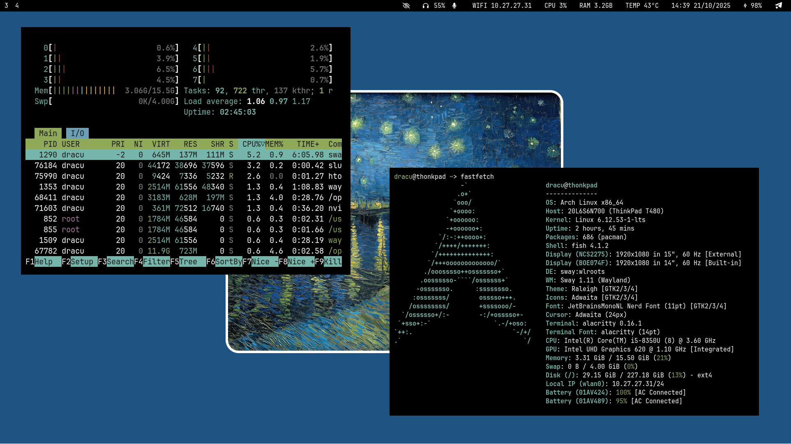

# Sway Setup Guide (Arch-based)

A minimal and functional Sway desktop setup for Arch-based distributions.



### Table of Contents

- [AUR Helper (yay)](#aur-helper-yay)
- [Install Sway & Essential Packages](#install-sway--essential-packages)
- [Install AUR Packages](#install-aur-packages)
- [Apply Dotfiles](#apply-dotfiles)
- [Neovim with LazyVim](#neovim-with-lazyvim)
- [PNPM Setup](#pnpm-setup)
- [Git Setup](#git-setup)
- [Docker Setup](#docker-setup)
- [QEMU/KVM Virtualization](#qemukvm-virtualization)
- [Power Management](#power-management)

---

## AUR Helper (yay)

```bash
sudo pacman -S --needed git base-devel
git clone https://aur.archlinux.org/yay.git
cd yay && makepkg -si
```

---

## Install Sway & Essential Packages

```bash
# Install Sway
sudo pacman -S --needed sway swaylock swaybg swayidle

# Install essential packages
sudo pacman -S --needed \
  bluez blueman dunst alacritty brightnessctl cliphist fd firefox fzf grim \
  ly mpv nemo nemo-fileroller nwg-look pipewire pipewire-alsa \
  pipewire-audio pipewire-jack pipewire-pulse playerctl ripgrep slurp \
  tmux tlp ttf-font-awesome ttf-jetbrains-mono-nerd waybar \
  wf-recorder wireplumber wl-clipboard wofi \
  stow fish foot pamixer
```

---

## Install AUR Packages

```bash
yay -S waylogout-git neovim-git wifi-qr zen-browser nodejs-lts-jod wl-color-picker dragon-drop
```

---

## Apply Dotfiles

```bash
git clone https://github.com/dracu-lah/swaydots
cd swaydots
stow .
```

---

## Neovim with LazyVim

[lazyvim.org](https://www.lazyvim.org/installation)

```bash
mv ~/.config/nvim{,.bak}
git clone https://github.com/LazyVim/starter ~/.config/nvim
rm -rf ~/.config/nvim/.git
nvim
```

---

## PNPM Setup

```bash
curl -fsSL https://get.pnpm.io/install.sh | sh -
```

---

## Git Setup

[GitHub SSH Setup](https://docs.github.com/en/authentication/connecting-to-github-with-ssh/generating-a-new-ssh-key-and-adding-it-to-the-ssh-agent#generating-a-new-ssh-key)

```bash
git config --global user.email "nevilnicks4321@gmail.com"
git config --global user.name "dracu-lah"
ssh-keygen -t ed25519 -C "nevilnicks4321@gmail.com"
cat ~/.ssh/id_ed25519.pub | wl-copy
```

---

## Docker Setup

[itsfoss.com](https://itsfoss.com/install-docker-arch-linux/)

```bash
sudo pacman -S --needed docker docker-compose
sudo systemctl start docker.service
sudo systemctl enable docker.service
sudo usermod -aG docker $USER
newgrp docker
```

---

## QEMU/KVM Virtualization (Optional)

[christitus.com](https://christitus.com/setup-qemu-in-archlinux/)

```bash
sudo pacman -S --needed qemu virt-manager virt-viewer dnsmasq vde2 \
  bridge-utils openbsd-netcat ebtables iptables libguestfs
```

Edit config:

```bash
sudo nano /etc/libvirt/libvirtd.conf
```

Add:

```conf
unix_sock_group = "libvirt"
unix_sock_rw_perms = "0770"
```

Add user:

```bash
sudo usermod -aG libvirt $(whoami)
newgrp libvirt
```

Reboot and run:

```bash
virt-manager
```

---

## Power Management

Enable TLP:

```bash
sudo systemctl enable --now tlp.service
```
