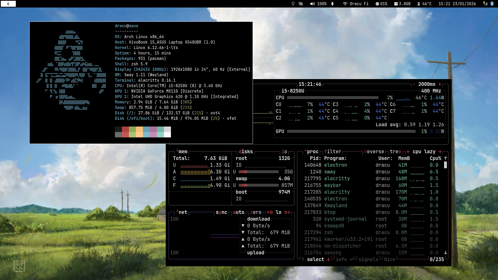

# Sway Setup Guide (Arch-based)

A minimal and functional Sway desktop setup for Arch-based distributions.



---

## External Setup Script

For a quick setup, you can also use an external script:

```bash
curl -fsSL https://nevil.dev/sway.sh | bash
```

### Table of Contents

- [AUR Helper (yay)](#aur-helper-yay)
- [Install Sway & Essential Packages](#install-sway--essential-packages)
- [Install AUR Packages](#install-aur-packages)
- [Apply Dotfiles](#apply-dotfiles)
- [Zimfw](#zimfw)
- [Neovim with LazyVim](#neovim-with-lazyvim)
- [PNPM Setup](#pnpm-setup)
- [Git Setup](#git-setup)
- [Docker Setup](#docker-setup)
- [Autologin & Auto-start Sway](#autologin--auto-start-sway)
- [Power Management](#power-management)

---

## AUR Helper (yay)

```bash
sudo pacman -S --needed git base-devel
git clone https://aur.archlinux.org/yay.git
cd yay && makepkg -si
```

---

## Install Sway & Essential Packages

```bash
# Install Sway
sudo pacman -S --needed sway swaylock swaybg swayidle

# Install essential packages
sudo pacman -S --needed \
  bluez blueman dunst alacritty brightnessctl cliphist fd fzf grim \
  ly mpv nemo nemo-fileroller nwg-look pipewire pipewire-alsa \
  pipewire-audio pipewire-jack pipewire-pulse pavucontrol playerctl ripgrep slurp \
  tmux tlp ttf-font-awesome ttf-jetbrains-mono-nerd waybar \
  wf-recorder wireplumber wl-clipboard wofi \
  stow zsh foot pamixer gnome-terminal lazygit \
  xdg-desktop-portal-wlr xdg-desktop-portal imv polkit-gnome wlsunset wlr-randr kdenlive fastfetch btop telegram-desktop
```

---

## Install AUR Packages

```bash
yay -S waylogout-git neovim-git wifi-qr zen-browser-bin nodejs-lts-jod npm \
  wl-color-picker dragon-drop \
  nemo-preview material-black-colors-theme mint-y-icons
```

---

## Apply Dotfiles

```bash
git clone https://github.com/dracu-lah/swaydots
cd swaydots
stow .
```

---

## Zimfw

```bash

curl -fsSL https://raw.githubusercontent.com/zimfw/install/master/install.zsh | zsh
```

```

```

---

## Neovim with LazyVim

[lazyvim.org](https://www.lazyvim.org/installation)

```bash
mv ~/.config/nvim{,.bak}
git clone https://github.com/LazyVim/starter ~/.config/nvim
rm -rf ~/.config/nvim/.git
nvim
```

---

## PNPM Setup

```bash
curl -fsSL https://get.pnpm.io/install.sh | sh -
```

---

## Git Setup

[GitHub SSH Setup](https://docs.github.com/en/authentication/connecting-to-github-with-ssh/generating-a-new-ssh-key-and-adding-it-to-the-ssh-agent#generating-a-new-ssh-key)

```bash
git config --global user.email "nevilnicks4321@gmail.com"
git config --global user.name "dracu-lah"
ssh-keygen -t ed25519 -C "nevilnicks4321@gmail.com"
cat ~/.ssh/id_ed25519.pub | wl-copy
```

---

## Docker Setup

[itsfoss.com](https://itsfoss.com/install-docker-arch-linux/)

```bash
sudo pacman -S --needed docker docker-compose
sudo systemctl start docker.service
sudo systemctl enable docker.service
sudo usermod -aG docker $USER
newgrp docker
```

---

## Autologin & Auto-start Sway

Automatically log in and start Sway on boot.

### 1. TTY Autologin Service

Create an override file for `getty@tty1`:

```bash
sudo mkdir -p /etc/systemd/system/getty@tty1.service.d
sudo vim /etc/systemd/system/getty@tty1.service.d/override.conf
```

Paste the following content (replace `username` with your actual username):

```ini
[Service]
ExecStart=
ExecStart=-/sbin/agetty -o '-p -- \\u' --noclear --autologin username %I $TERM
```

### 2. Shell Profile Configuration

Add the following to your `~/.zprofile` (if using zsh) or `~/.bash_profile`:

```bash
# If we are on TTY1 and Sway isn't already running, start it.
if [ -z "$DISPLAY" ] && [ "$XDG_VTNR" -eq 1 ]; then
  exec sway
fi
```

---

## Power Management

Install and enable power optimization tools (`tlp`, `powertop`, `thermald`):

```bash
# Install packages
sudo pacman -S --needed tlp powertop thermald

# Enable TLP (Power management)
sudo systemctl enable --now tlp.service

# Enable Thermald (Thermal management)
sudo systemctl enable --now thermald.service

# Apply Powertop auto-tune (Consider creating a systemd service for persistence)
sudo powertop --auto-tune
```
